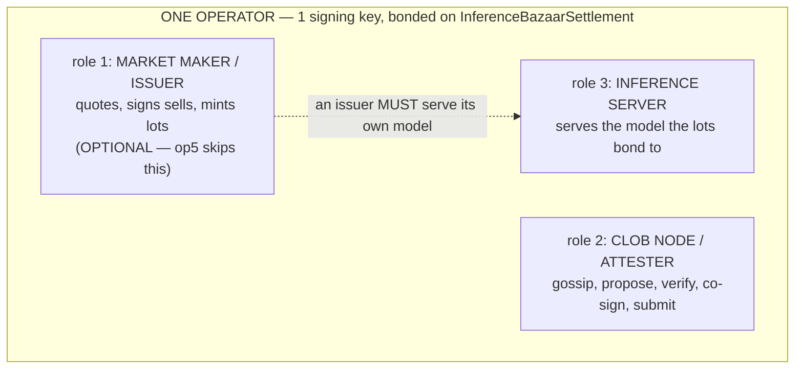
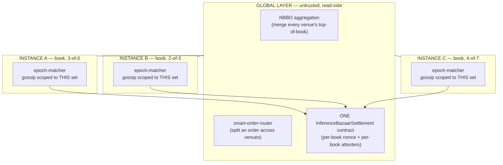

# Inference Bazaar architecture — operators, roles, and how it scales

This doc answers three questions that recur:

1. Is a "CLOB node" the same thing as an "operator" or a "market maker"?
2. What does each party *attest* to, and how?
3. Does this scale to thousands of operators, and how does a trader see **one**
   market when liquidity lives across many independent books?

The short version: **an operator is a node; "market maker", "CLOB attester",
and "inference server" are separable *roles* it can run.** Liquidity is **two
layers** — a small per-instance matcher (trusted, m-of-n) and a global,
*untrusted*, read-side aggregation (NBBO + smart-order-router) anchored by one
settlement contract. There is **no global matching mesh**, which is exactly why
it scales.

---

## 1. Operator vs market maker vs CLOB node

These are not three machines. They are roles layered inside one operator
process (the `inference-bazaar-operator` binary). One identity (one EIP-712 signing key,
bonded with collateral on `InferenceBazaarSettlement`) can wear up to three hats:

```
┌─────────────────────────── ONE OPERATOR (inference-bazaar-operator process) ───────────────────────────┐
│  identity: 1 EIP-712 signing key  ·  bonded (collateral) on InferenceBazaarSettlement                   │
│                                                                                                 │
│   ┌── role 1: MARKET MAKER / ISSUER ──┐  ┌── role 2: CLOB NODE ────┐  ┌── role 3: INFERENCE ──┐ │
│   │ • quoting loop (mm-sidecar)        │  │ • gossip orders         │  │ • serves the model    │ │
│   │ • SIGNS sell orders → mints lots   │  │ • elected proposer      │  │   the lots bond to    │ │
│   │ • backs lots w/ its own inference  │  │   (round-robin / epoch) │  │ • /v1/chat/completions│ │
│   │ • RFQ + resting CLOB quotes        │  │ • match epoch (H3 sim)  │  │ • managed vLLM OR a   │ │
│   │                                    │  │ • verify + co-sign peer │  │   configured URL      │ │
│   │   ⟵ OPTIONAL: op5 skips this ⟶     │  │ • submit settleBatch    │  │                       │ │
│   └────────────────────────────────────┘  └─────────────────────────┘  └───────────────────────┘ │
│          "issuer"                              "attester"                  invariant: an ISSUER  │
│                                                                           must serve its OWN     │
│   Drop role 1 (no quoter) → an "attester-only" node, e.g. op5.            model, not resell      │
└─────────────────────────────────────────────────────────────────────────────────────────────────┘
```



**The distinction that matters:** every CLOB node is a bonded operator, but a
CLOB node does **not** have to issue. The only role that is structurally
required of a CLOB member is *attester* (co-sign batches); market-making is
opt-in on top. `op5` (the independent-datacenter third attester) is the living
proof — it co-signs but has no quoting loop, so it never issues.

> This is why the `venue.rs:130` invariant ("a bonded issuer must serve its own
> model") is subtle: it treats *being in a book* as *being an issuer*. A
> pure attester like op5 is in the book but does not issue, so the invariant is
> slightly broader than the role it guards. (Bridged today by pointing
> `INFERENCE_BAZAAR_INFERENCE_URL` at the Tangle Router; the durable fix is an explicit
> attester-only mode.)

### The live fleet today (one book, `0x0`, 2-of-3)

```
                         BOOK 0x0  ·  threshold 2-of-3  ·  epoch = 10s
   NUREMBERG (178.104.232.124)                          HELSINKI (95.216.8.253)
   ┌────────────────────────────┐    gossip + co-sign    ┌────────────────────────┐
   │ op 0x2420 :9500            │◀──────(HTTP)──────────▶│ op5 0x7283 :9500       │
   │  MM + CLOB + inference      │                        │  CLOB ONLY (attester)  │
   │ op 0x483f :9400            │◀──────────────────────▶│  ✗ no MM   ✓ co-signs   │
   │  MM + CLOB + inference      │                        │  independent DC = BFT  │
   └─────────────┬──────────────┘                        └───────────┬────────────┘
       mm-sidecar :9310 (shared quoting brain)                       │
   ┌────────────────────────────┐                                    │
   │ USDC venue :9600 (lite)    │  ← separate rail, NOT in book 0x0   │
   └────────────────────────────┘                                    │
                                 proposer submits settleBatchAttested(book, fills, 2-of-3 sigs)
                                            ▼
                       ┌──────────────────────────────────┐
                       │  InferenceBazaarSettlement (Base Sepolia) │  re-verifies quorum, applies fills,
                       │  0x64867eac…  · book 0x0 nonce++  │  enforces balance/collateral/cap
                       └──────────────────────────────────┘
```

---

## 2. Does it scale to 10,000 operators? — the two-layer model

**Not as one book.** A single global book with 10,000 co-signing attesters does
**not** scale: gossip is ~O(n²), each proposal carries the matched order set,
and a 10,000-way quorum is absurd. That is *not* the design.

Liquidity is **two orthogonal layers** (this is the locked target):

```
                       ┌──────────────── GLOBAL LAYER (untrusted, read-side) ────────────────┐
                       │  NBBO aggregation  +  smart-order-router  +  ONE InferenceBazaarSettlement   │
                       │  "aggregation introduces NO new trust"                               │
                       └──────────────┬───────────────────┬───────────────────┬──────────────┘
                                      │                    │                   │
          ┌───────────────────────────┘         ┌──────────┘         ┌─────────┘    … thousands of instances
          ▼                                      ▼                    ▼
   ┌─────────────────┐                    ┌─────────────────┐  ┌─────────────────┐
   │ INSTANCE A      │                    │ INSTANCE B      │  │ INSTANCE C      │
   │ book = 3-of-5   │                    │ book = 2-of-3   │  │ book = 4-of-7   │
   │ epoch-matcher   │                    │ epoch-matcher   │  │ epoch-matcher   │
   │ gossip SCOPED   │                    │ gossip SCOPED   │  │ gossip SCOPED   │
   │ to THIS set     │                    │ to THIS set     │  │ to THIS set     │
   └─────────────────┘                    └─────────────────┘  └─────────────────┘
   small bonded set, matches + settles    each independent      each independent
   its own epochs locally                 its own book          its own book
```



**Layer 1 — within a service instance (small, trusted, m-of-n).** A *service
instance* is a small bonded operator set (a handful, e.g. 3-of-5). It runs the
epoch-matcher we deployed — gossip, election, verify, co-sign, settle. Crucially
the gossip transport (`blueprint-networking`) is **hard-scoped per instance**:
topic `/{network}/{instance_id}` + a per-instance `AllowedKeys` whitelist. A
book never gossips outside its own set. Cost per instance is bounded by the
instance size, **not** by the global operator count.

**Layer 2 — across instances (large, untrusted, read-side).** There is **no
global matching mesh and no privileged venue.** Convergence to "one market"
comes from three things that all scale trivially because none of them match
orders globally:

- **One settlement contract** — every book settles to the same
  `InferenceBazaarSettlement`, scoped by `bookId` (per-book nonce + per-book attester
  set). On-chain throughput, not consensus, is the only shared limit, and it's
  shardable across L2s later.
- **Uniform, portable orders** — every order on every venue is the same EIP-712
  `Order` under the same domain, backed by the same collateral rule. That's what
  makes quotes from different operators *directly comparable and identically
  settleable*.
- **NBBO aggregation + a smart-order-router** — a cheap read-side merge (below).

**So: you scale by adding instances, not by growing one book.** 10,000 operators
become ~thousands of small books with a thin aggregation overlay — that scales.
10,000 operators in one mesh would not, and is not the design.

---

## 3. Who attests to what, and how

Two very different things are happening, and only one of them involves trust.

**Within a book — the attesters co-sign a batch.** The elected proposer matches
the epoch (set-deterministic: price priority, digest tiebreak — zero sequencing
discretion). Peers independently re-execute the match over the same gossiped,
individually-signed order set and co-sign `(bookId, batchNonce, fillsHash)`.
What the quorum is attesting:

- *the trader signatures are authentic* — the contract does **not** re-verify
  trader sigs on-chain (a `BatchFill` carries none), so **the m-of-n quorum IS
  the authenticity check**. A co-signer that vouches for a forged order is the
  attack, and `verify_proposal` (`Verdict::Forged`) is what stops it.
- *the match is the correct, censorship-free result of that order set* — peers
  recompute it bit-for-bit, so the proposer can't reorder, fake, or censor.

Even a fully rogue quorum is bounded: the contract still enforces
balance/collateral/cap invariants on every fill regardless of who signed, so the
worst a bad quorum can do is vouch for signatures never made — and that's what
the (maturing) SP1 *proven* path and the BSM fraud-claim slashing rail exist to
punish. The matcher's bond is slashable for provable misconduct.

**Across books — nobody attests to the NBBO.** This is the key invariant from
the spec: *aggregation introduces no new trust.* The consolidated view is just a
merge of prices that are each already an operator's signed-quotable order, each
settling with the same two-signature atomicity as a single-venue trade. A trader
can recompute the NBBO themselves from the raw venues; there is no global
attester, no privileged aggregator, nothing to trust at the global layer.

---

## 4. NBBO and the single market view

**NBBO = National Best Bid and Offer** — the term from US equities (Reg NMS) for
the best bid (highest price anyone will buy at) and best offer/ask (lowest price
anyone will sell at) **consolidated across every venue**. Here it means: the
best bid and best ask merged across all the per-instance books, so a trader sees
**one** top-of-book instead of N separate ones.

The "one CLOB view" is a **read-side consolidation, not one giant matching
engine.** Who does it and how:

1. **Discovery is on-chain.** `registerOperator(blueprintId, ecdsaPubkey,
   rpcAddress)` puts every operator's venue URL in protocol state. A client
   enumerates instances (`getService(id)`), unions their operator sets
   (`getServiceOperators`), and reads each operator's `rpcAddress`
   (`getOperatorPreferences`). No app config — the registry *is* the chain.
2. **Aggregation is a merge.** For an instrument, fetch every healthy venue's
   `/book`, merge the levels into one ladder, tag each level with its operator.
   Best bid/ask across venues = the displayed top of book. Discount = 1 − NBBO
   ask / list price.
3. **Routing splits over the ladder.** A firm buy either RFQs all venues and
   settles against the best quote, or (larger than the top level) the
   smart-order-router walks the merged ladder and splits across operators — one
   settlement per contributing operator, all on the one contract.

Because every order is uniform and identically settleable (§2), the merged
ladder *means* something: op A's ask is directly comparable to op B's ask and
either settles the same way. That uniformity is what makes a single market view
possible without a single matching engine.

```
   trader sees ONE consolidated book:                  but it's assembled, not centralized:
   ┌───────────────── claude-sonnet-4-6:output ─────────────────┐
   │  ASK  12.0%  off   ◀── op 0x2420 (instance A)              │   each level is one operator's
   │  ASK  11.5%  off   ◀── op 0x9f31 (instance B)              │   own signed, on-tick quote,
   │  ── spread ──                                              │   fetched from /book and merged
   │  BID  10.2%  off   ◀── op 0x483f (instance A)              │   client-side. NBBO = best row
   │  BID   9.8%  off   ◀── op 0xbeef (instance C)              │   each side. SOR fills down it.
   └────────────────────────────────────────────────────────────┘
```

---

## 5. What's live vs. designed (no overclaiming)

| Layer | Piece | Status |
|---|---|---|
| 1 | Per-instance epoch-matcher, **attested** path (gossip → match → quorum → `settleBatchAttested`) | **LIVE** — running on book `0x0`, 2-of-3, Base Sepolia |
| 1 | PKI mesh transport (`blueprint-networking`, per-instance scoped) | Built (`--features mesh`); fleet runs the HTTP transport today |
| 1 | **Proven** path (SP1 circuit → `settleBatchProven`) | Off-chain validated; on-chain verifier registration pending (funded op) |
| 2 | Venue registry + **NBBO** + competitive RFQ | Built (app, Phase A) |
| 2 | Smart-order-router (split across venues) | Built (`app/src/lib/router.ts`); exec/UI wiring in progress |
| — | BSM fraud-claim wiring (co-signed censorship/forge claim → `proposeSlash`) | Open |

**Honest caveat:** the architecture *supports* thousands of operators, but it
runs at **N = 1 book** today. "10,000 operators" is the design the two layers
are built for — many small books + an untrusted aggregation overlay — not a
state the system has been exercised at. The pieces exist; the scale test does
not yet.
